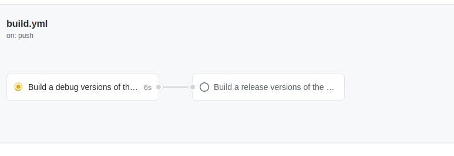
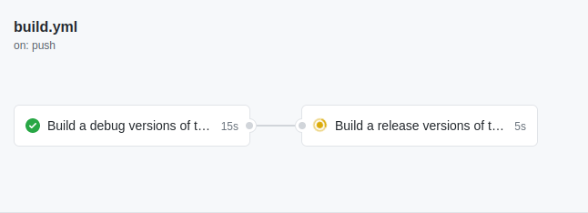
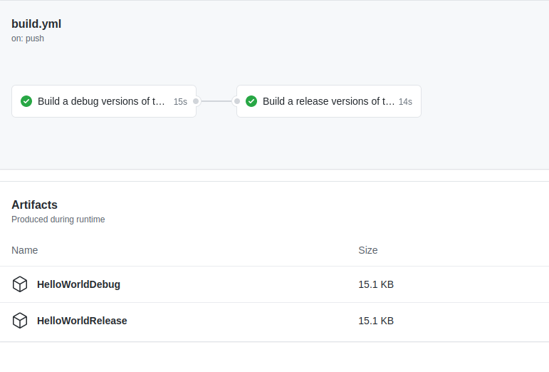

_Full source code available [here](media/GitHubActionsHelloWorld_Debug_And_Release.zip)_.

In the previous post I gave a quick introduction to GitHub Actions showing how to build a small Hello World application and make the artifact available for download. 

In this post I'll show how to build debug and release versions of the same application, with the release only being built if the debug one builds successfully. 
This in itself is not a whole lot of use, but in the next post I'm going to show how to add manual approvals before performing certain jobs, like deploying built code to AWS. In that scenario, a build will occur, a user needs to inspect the output and the approve deploying the artifact, now that is useful.

But for now, I'm keeping it simple without the complications of external services, secrets, environment variables, etc. 

### The Code
The C# is very simple, print a different piece of text depending on the build configuration.


class Program
{
    static void Main(string[] args)
    {
        #if DEBUG
            Console.WriteLine("Hello World! From debug build.");
        #endif
        #if RELEASE       
            Console.WriteLine("Hello World! From release build.");
        #endif
    }
}


### Two Jobs in the GitHub Action Workflow
In the previous post there was only one job, but you can have as many as you want, and these jobs can run independently (and in parallel) or have dependencies on each other, e.g. job 2 runs only if job 1 succeeds. 

In this example I want to run the release build only if the debug build succeeds. 

The overall structure of the workflow looks like this - 


name: A workflow to build an application in debug and release

on:
  push:
    branches: [ main ]

jobs:
  debug-build:
    name: Build a debug versions of the app
    # snip..

  release-build:
    needs: debug-build
    name: Build a release versions of the app
    # snip..


In this example there are two jobs - `debug-build` and `release-build`. `release-build` depends on `debug-build` completing successfully. 
They both upload artifacts to which will be available for download from GitHub after the action completes. 

When the code is pushed to GitHub the `debug-build` starts. 

Once that completes successfully, the `release-build` starts.

What that finishes the two artifacts will be available to download. 

### You can run anything in a job
You are not limited to building software in jobs, you can run things too. 

After the build step in each job I have a run command that runs the compiled code, there is no good reason to do this here, but I've included it to show the flexibility of what you can do.


  - name: Run it for fun
    run: dotnet ./bin/debug/net5.0/GitHubActionsHelloWorldConsole.dll 


You can also use command that are available on the host Ubuntu operating system where the build is happening. 

In the next post I'll show how to add a manual approval before performing a step.

_Full source code available [here](media/GitHubActionsHelloWorld_Debug_And_Release.zip)_.